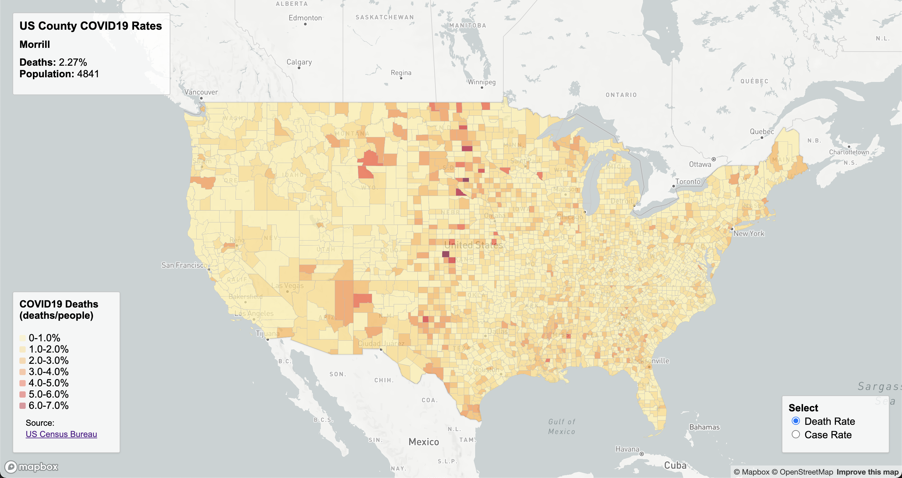
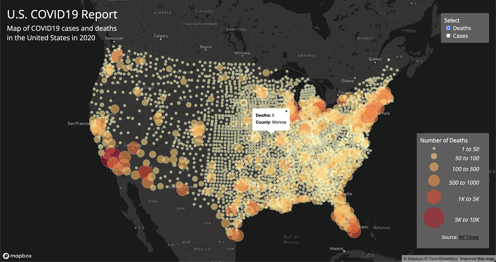

# Mapping of COVID19 Rates and Deaths in the United States

## Project Description
This is a mapping project of the COVID19 reports in the United States in 2018 and 2020. 

## Map 1: Choropleth map

[Map 1](https://nyu16.github.io/COVID19_Map_Reports/map1.html) is a choropleth map that shows different rates related to COVID19 in 2018. Users will find a legend on the bottom right of the map where they can choose which rate they wish to see - the rate of death and rate of cases per county. The rates were found through dividing the COVID19 values by the population of the respective county in 2018, and the data are 2018 ACS 5 year estimates from the [U.S. Census Bureau](https://data.census.gov/table?g=0100000US$050000&d=ACS+5-Year+Estimates+Data+Profiles&tid=ACSDP5Y2018.DP05&hidePreview=true). When the users hover the mouse over a specific county the specific values of cases/deaths and the rates will be shown on the top left legend of the map.

## Map 2: Symbology map

[Map 2](https://nyu16.github.io/COVID19_Map_Reports/map2.html) is a symbology map that shows various cases/deaths related to COVID19 in 2020. The symbol (circular data points) will appear bigger the larger the data value of the county. The colors get darker and deeper to help users find higher values easier, and to be able to read the trend more quickly. Users will find a legend on the top right of the map where they can choose which values they want to see - the number of deaths or the number of cases per county. The data was collected by the [NY Times](https://github.com/nytimes/covid-19-data/blob/43d32dde2f87bd4dafbb7d23f5d9e878124018b8/live/us-counties.csv) and was acquired from their public data. When the users hover the mouse over a specific county and click on it a window will pop up that displays the respective values and the county name
