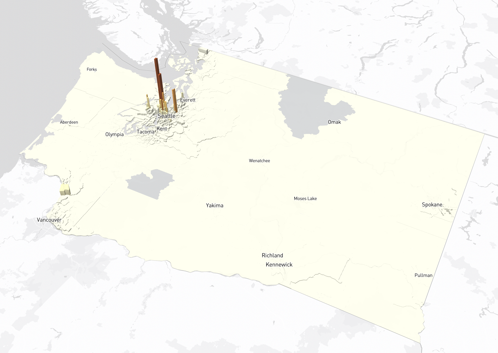

# Washington Pollutant Map

### [Website Link](https://calvinuw.github.io/Washington_pollutant_map)

## Team Members:
- Calvin Standaert
- Ryan Fournier
- Yongjung Lee
- Lawrence Lorbiecki
- Nicholas Yu

## Project Description:

This project is an interactive web map that shows the values of key environmental pollutant variables in each Washington state census tract. The map is three-dimensional and represents the values of a given pollutant in a census tract through the height and color of the representing polygon. For instance, if the map is depicting the average PM 2.5 concentration in a census tract, it shows low concentrations with a short and light-colored polygon, while high concentrations are shown with a tall and dark-colored polygon. The pollutant being shown is shown by the legend on the right-hand side of the map and is changeable via a menu on the left-hand side of the map, which can be clicked on to change the dataset being shown on the map. Additionally, the map displays more in-depth information on a given census tract through click-event support, wherein a census tract can be clicked on to show its value’s place in the larger variable distribution. To enable easy navigation of the geographical area of interest, there is a drop-down menu with city/area names that can be clicked on to recenter the map on that location.

Though the map is the most essential part of our project, the map is only a single page on our more extensive website, which has 4 pages in total. The first page provides a disclaimer and an introduction of the visual strategies and data source, the second page contains the actual map, the third page includes information on the datasets (with recommended, but unused datasets), and the fourth page provides some context on our team.

## Screenshots

### Map 1 - Lead in Housing Units

### Map 2 - Diesel and NoX Emissions

### Map 3 - Ozone Concentrations

### Map 4 - PM 2.5 Air Pollution Count

### Map 5 - Proximity to Heavy Traffic

### Map 6 - Hazardous Chemical Releases

## Project Goal:

We hope that by representing the values of different environmental pollutants throughout Washington state we can make a significant point about the distribution of pollutants in Washington and the possible inequalities associated with that distribution. We additionally aim to encourage other geographers and climate-minded individuals to gather datasets, make mapping projects, and in general, create digital objects that make visible environmental inequalities.

## Data Sources:

Most of the datasets used in this project are drawn from the environmental health disparities section of the [Washington Geospatial Open Data Portal](https://geo.wa.gov/). The datasets from the open data portal each essentially describe the prevalence of a certain environmental pollutant in all Washington State census tracts for a given year. Aside from environmental pollutant datasets, a cartographic shapefile was used to clip census tracts, and another dataset containing the location of Washington cities was used to enable a location search function in the map. Included below is a brief description and link to each dataset used.

The first [dataset](https://geo.wa.gov/datasets/WADOH::pm2-5-concentration-current-version/about) contains information on the prevalence of pm 2.5 micro meter air pollution within each Washington state census tract.

The second [dataset](https://geo.wa.gov/datasets/WADOH::lead-risk-from-housing-current-version/about 
) contains information on the number and percentage of housing units in each Washington state census tract that have lead in them.

The third [dataset](https://geo.wa.gov/datasets/WADOH::proximity-to-heavy-traffic-roadways-current-version/about) contains information on the proximity of census tracts to heavy-traffic roadways.

The fourth [dataset](https://geo.wa.gov/datasets/WADOH::ozone-concentration-current-version/about
) contains information on the ozone concentration of Washington state census tracts.

The fifth [dataset](https://geo.wa.gov/datasets/WADOH::nox-diesel-emissions-annual-tons-km2-current-version/about ) contains information on the diesel emission exposures of each Washington state census tract.

The sixth [dataset](https://geo.wa.gov/datasets/WADOH::toxic-releases-from-facilities-rsei-model-current-version/about ) contains information on the weighted toxic emissions for each Washington state census tract.

Besides the data from the Washington Geospatial Open Data Portal, a [cartographic boundary map](https://www.census.gov/geographies/mapping-files/time-series/geo/carto-boundary-file.html) of the Washington state land area was used.

For browsing different cities, the coorindates were acquired from the [Maps of World](https://www.mapsofworld.com/usa/states/washington/lat-long.html) and later converted into a CSV file.

## Applied Libraries:

Mapbox GL js

Bootstrap 5

Google Fonts

Font Awesome

D3 js

## Other Information:

To allow for the data from each dataset to be readily comparable across different scales, each variable used in the map was normalized using min-max normalization. The normalized values of each variable were then used to assign the height and color of census tract polygons.

Aside from min-max normalization, the geometry of the data was clipped using a cartographic boundary map from the United States census bureau. Clipping was performed on the data to limit census tract extent to only land areas, thereby improving geographic legibility.

The website of this project is best viewed in Google Chrome, Firefox, or Microsoft Edge. While the website and map contained in it can run on other browsers, certain map and website elements may be missing, dysfunctional, or otherwise improperly displayed.

## Acknowledgement:

We would like to thank our teacher, Professor Zhao, and our teaching assistant, Xiaoqi Bao for their help throughout the development process.

## Code Ownership Statement:

In the spirit of open-source development, all code contained in this project is free to reference or use without limitation. Code attribution or acknowledgment of the authors of this code is appreciated, but unnecessary.