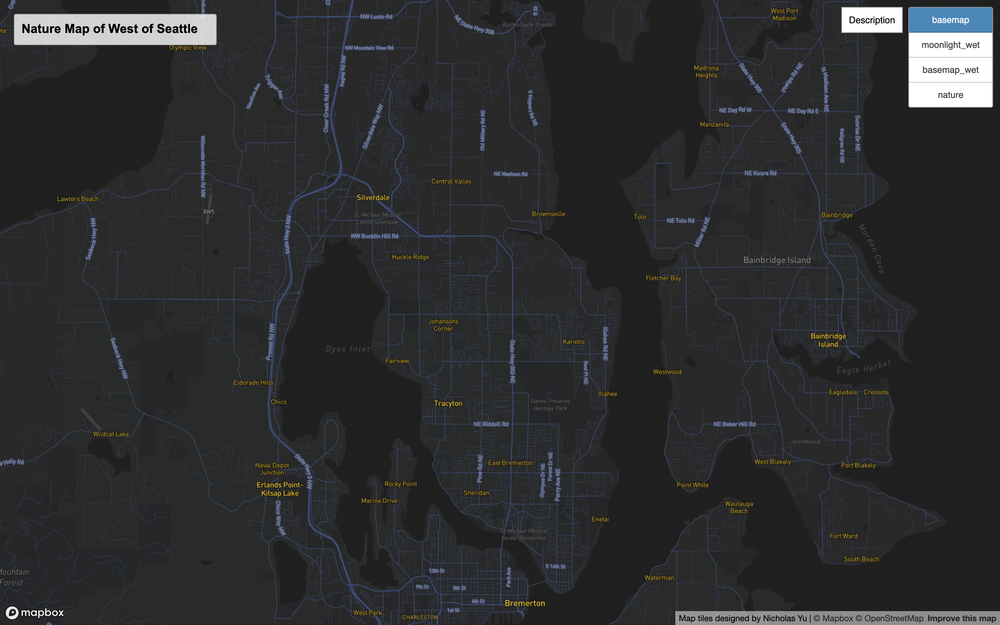
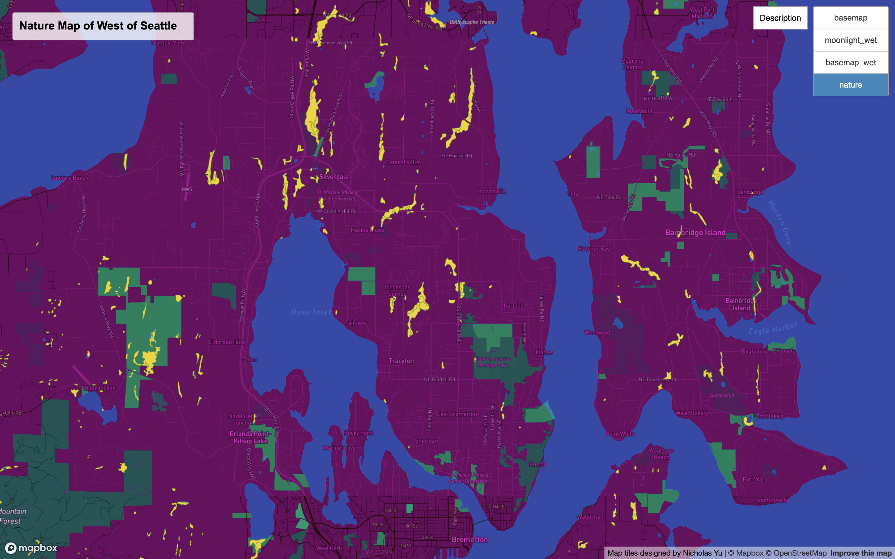

# Lab 4: Map Design and Tile Generation

This is a [thematic map](https://nyu16.github.io/projects/ThematicMaps) of cities on the west of Seattle including Bainbridge Island, Silverdale, Enetai, Suquamish, Kingston, and Bremerton. The menu on the top right of the map allows the user to view the map in four different options. First of the four map tile views is the basemap. 

The base map shows a dark monochrome version of the map. 

The second option shows the moonlight version of the map with wet lands marked in yellow on the map. 

The third option shows a base map with wet lands marked on the base map.

The last thematic map shows all the parks, trails, and wetlands on the map. The parks are marked in green, trails in white and the wetlands in yellow. The available zoom levels range from 12 to 9.8 at the maximum.
