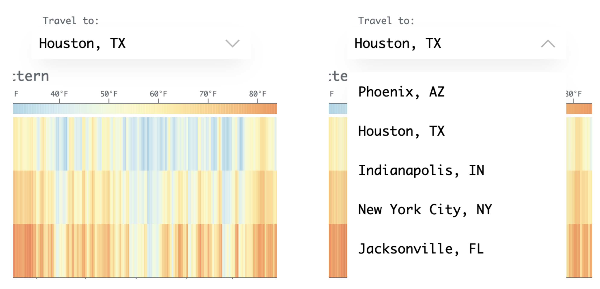
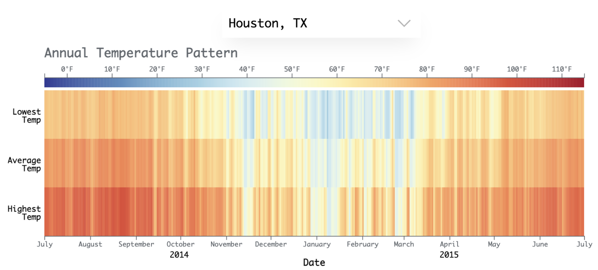
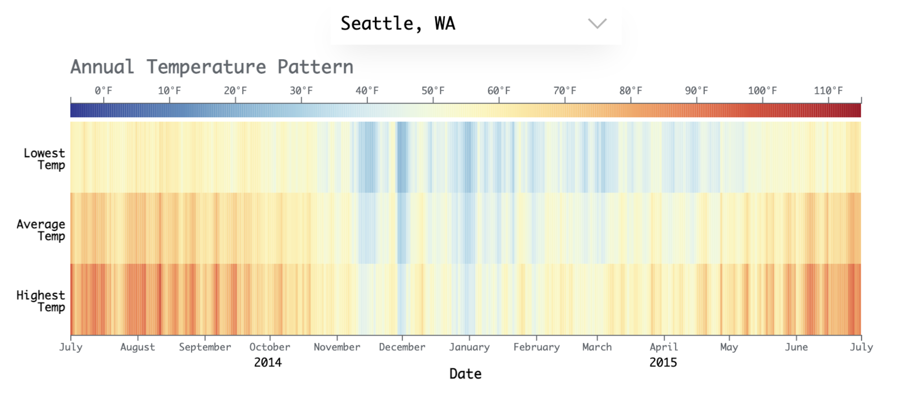
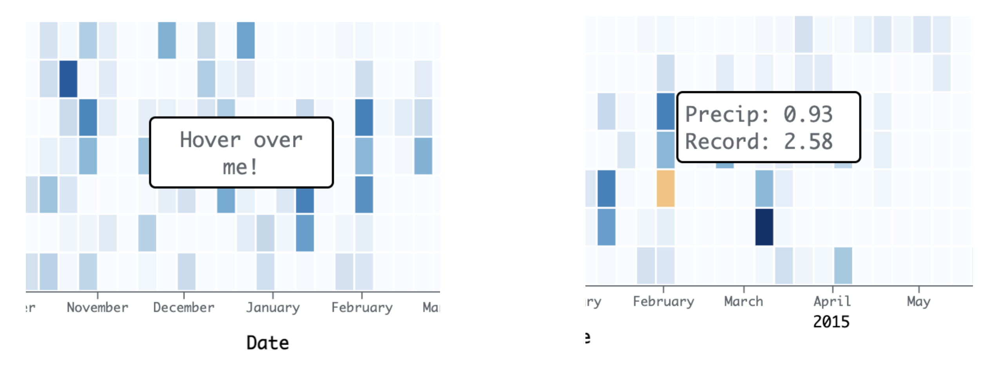

# Weather Map of Multiple U.S. Cities in 2016

## Description
The weather report visualization is mostly meant for those who are interested in moving to other cities or those who need to study annual weather pattern in different cities. The visualization allows for a number of tasks. Firstly, the user can choose to view the visualizations of various cities: Houston, TX, Phoenix, AZ, Indianapolis, IN, New York City, NY, Jacksonville, FL, Seattle, WA, Charlotte, NC, Los Angeles, CA, Chicago, IL, and lastly Philadelphia, PA. The visualization will update charts based on user’s chosen city data using Enter, Update, Exit method of D3. The choices are offered in a dropdown menu as shown in the below screenshots.

The first weather chart is intended to show the temperature in a day of the chosen city. The graph is a combination of three different parts showing the lowest temperature, average temperature, and the highest temperature measured on the day of the city. The point was to give a sense of the temperature pattern throughout the day. The temperature color is meant to be intuitive, ranging from dark blue when it’s cold (towards -5 ̊F) to dark red (towards 115 ̊F). The range of temperature was chosen based on the maximum temperature and the minimum temperature values from all data. When chosen, the chart will change its data accordingly with a short animation as shown in the screenshots provided below. This way, the user can get a feeling of how hot or cold the city is all year round, and use the knowledge before moving or studying overall weather patterns.

The second chart includes information related to the precipitation amount in the city. The map is in a calendar form, and individual rectangles stand for a day in the city. When there were no precipitation, the individual rectangles will be colored with light blue close to white. And when it rained a lot, the rectangles are colored darker close to navy. Users can hover over individual rectangles to view the date, measured precipitation, and the recorded precipitation amount of the day.

